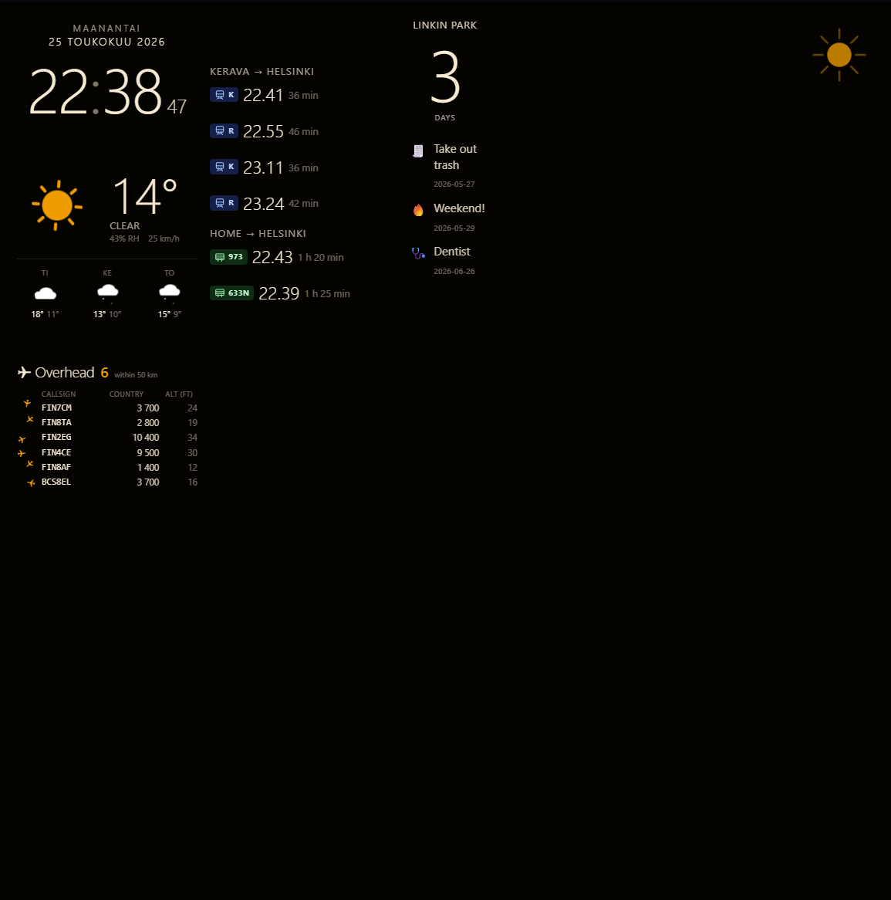
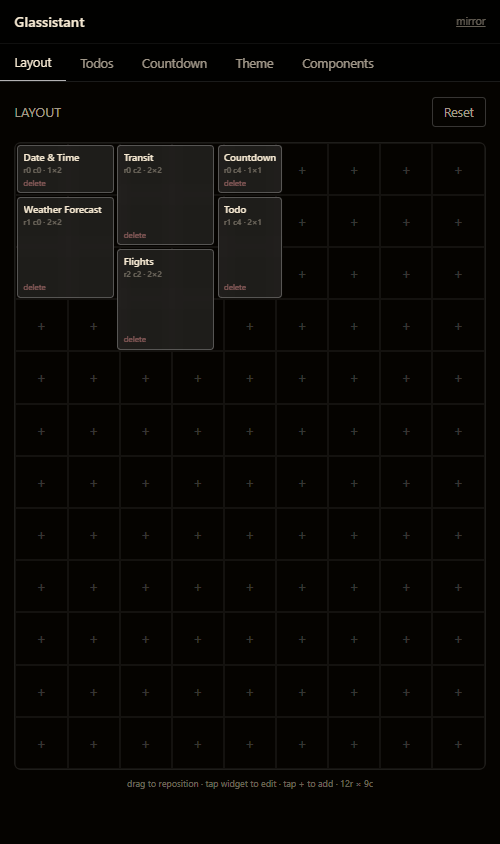
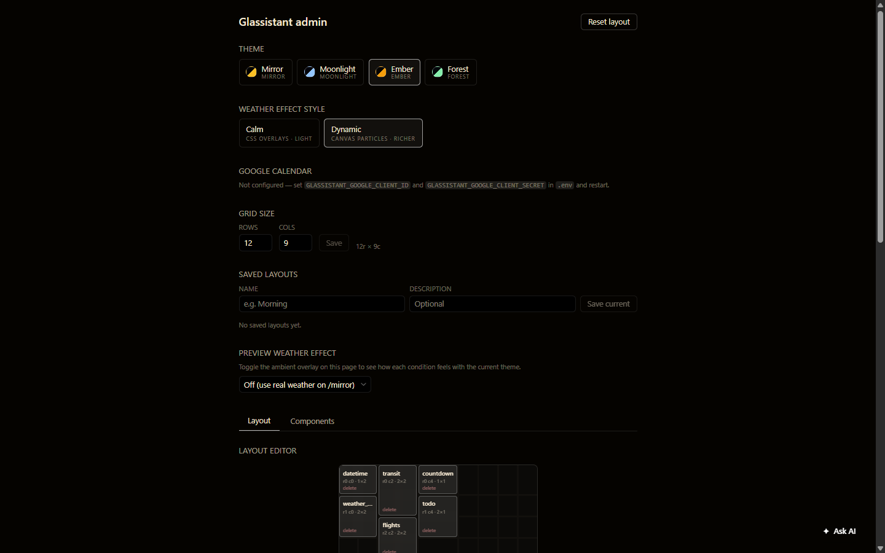
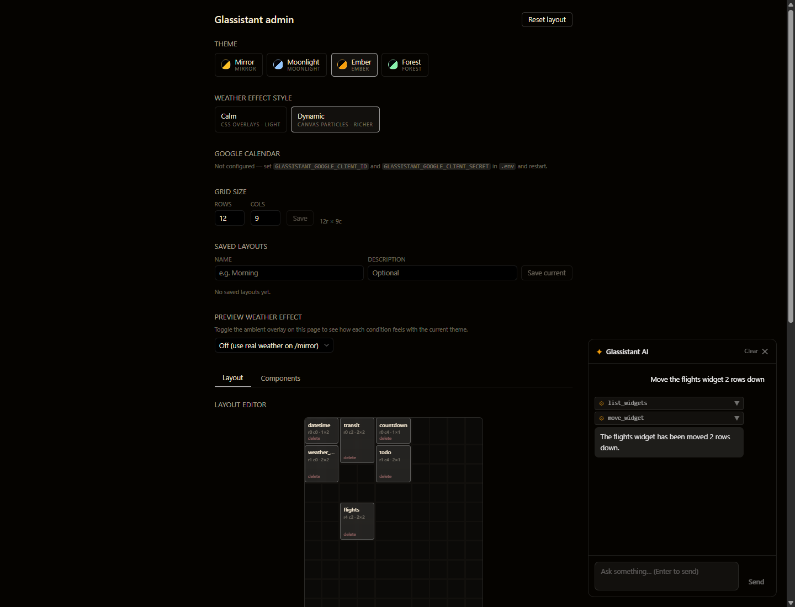

# Glassistant

Magic-mirror home assistant. The idea in the long run is to have a Raspberry Pi driving a monitor behind a two-way mirror; widgets are arranged on a dynamic grid. An AI agent powered by Ollama can rearrange the dashboard, answer questions, and use tools — all without leaving the room.

Currently very much WIP. Claude Code has been very helpful during the project.

---

## Screenshots

### Mirror — kiosk view

> Full-screen widget grid displayed on the mirror.

<!-- Replace with an actual screenshot -->


---

### Mobile — touch controller

> Responsive mobile UI for managing the layout, todos, countdowns and theme from your phone.

<!-- Replace with an actual screenshot -->


---

### Admin — desktop controller

> Full-featured admin panel with layout editor, component browser, saved layouts, Google Calendar auth, and weather effect preview.

<!-- Replace with an actual screenshot -->


---

### AI — chat panel

> Floating chat panel in the admin view. The Ollama-backed ReAct agent can add, move, and remove widgets in real time via tool calls, with streaming output and collapsible tool-step cards.

<!-- Replace with an actual screenshot -->


---

## Stack

- **Backend:** Python 3.11+, FastAPI, uvicorn, stdlib `sqlite3` (no ORM).
- **Frontend:** Vite, React 18, TypeScript, Tailwind, React Router.
- **Persistence:** SQLite file in `backend/glassistant.db`.
- **AI:** [Ollama](https://ollama.ai) (local LLM, tool-use compatible model required — e.g. `llama3.1`).

## Widgets

| Key | Label | Description |
|-----|-------|-------------|
| `clock` | Clock | Current time with 12/24 h and optional seconds |
| `date` | Date | Day, date number, and month name |
| `datetime` | Date & Time | Full date header with large clock |
| `weather` | Weather | Current conditions — temp, icon, humidity, wind |
| `weather_forecast` | Weather Forecast | Current + 3-day compact forecast |
| `transit` | Transit | Upcoming HSL departures for configured routes |
| `calendar` | Calendar | Google Calendar — current week view |
| `todo` | Todo | Scrolling task list sorted by due date |
| `countdown` | Countdown | Days/hours until or since a target date |
| `spotify` | Spotify | Currently playing track — album art, title, progress |
| `flights` | Flights | Live aircraft overhead via OpenSky Network |

## Routes

| Path | Description |
|------|-------------|
| `/mirror` | Kiosk view — widget grid, ambient weather overlay |
| `/admin` | Desktop controller — layout editor, settings, AI chat |
| `/mobile` | Mobile controller — touch-friendly tabs for layout, todos, theme |

## Local development (Windows)

Requires Python 3.11+ available as `py`, Node 20+, and Ollama running locally.

### Backend

```powershell
cd backend
py -m venv .venv
.venv\Scripts\Activate.ps1
pip install -e .[dev]
uvicorn app.main:app --reload --port 8000
```

Backend serves on `http://localhost:8000`. Health check at `/healthz`.

### Frontend

```powershell
cd frontend
npm install
npm run dev
```

Frontend dev server runs on `http://localhost:5173` and proxies `/api` to the backend.

Open the views:
- `http://localhost:5173/mirror` — the kiosk view
- `http://localhost:5173/admin` — the desktop controller
- `http://localhost:5173/mobile` — the mobile controller

### Ollama (AI agent)

Install [Ollama](https://ollama.ai), then pull a tool-use capable model:

```bash
ollama pull llama3.1
```

Set `GLASSISTANT_OLLAMA_MODEL=llama3.1` in `.env` (or the model of your choice). The chat panel in `/admin` will activate automatically once Ollama is reachable.

### Tests

```powershell
cd backend
pytest
```

### Production-style serving (single process)

```powershell
cd frontend
npm run build
cd ..\backend
uvicorn app.main:app --port 8000
```

Then open `http://localhost:8000/mirror` — FastAPI serves the built frontend from `frontend/dist`.

## REST API

| Method | Path | Description |
|--------|------|-------------|
| GET | `/api/layout` | Full widget list + grid dimensions |
| POST | `/api/widgets` | Create widget |
| PATCH | `/api/widgets/{id}` | Update widget (partial) |
| DELETE | `/api/widgets/{id}` | Delete widget |
| POST | `/api/layout/reset` | Reset to default layout |
| GET | `/api/widget-types` | All registered widget types from the backend registry |
| GET | `/api/weather?lat=&lon=` | Open-Meteo proxy (10-min TTL cache) |
| GET | `/api/transit` | HSL real-time departures |
| GET | `/api/flights` | Live aircraft overhead via OpenSky Network |
| GET | `/api/todos` | List todo items |
| POST | `/api/todos` | Create todo item |
| PATCH | `/api/todos/{id}` | Update todo item |
| DELETE | `/api/todos/{id}` | Delete todo item |
| GET | `/api/calendar/status` | Google Calendar auth status |
| GET | `/api/calendar/auth` | Begin Google OAuth flow |
| GET | `/api/calendar/callback` | OAuth callback |
| GET | `/api/calendar/events` | Fetch calendar events |
| GET | `/api/saved-layouts` | List saved layouts |
| POST | `/api/saved-layouts` | Save the current layout |
| POST | `/api/saved-layouts/{id}/load` | Restore a saved layout |
| DELETE | `/api/saved-layouts/{id}` | Delete a saved layout |
| POST | `/api/chat` | Streaming AI agent endpoint (SSE) |
| GET | `/api/events` | SSE stream (`layout_changed`, `settings_changed`, …) |
| GET | `/api/settings` | Key/value settings dict |
| PUT | `/api/settings/{key}` | Update a setting |
| GET | `/healthz` | Health check |

## Configuration

Copy `.env.example` to `.env` and fill in the values you need:

| Variable | Description |
|----------|-------------|
| `GLASSISTANT_HOME_LAT` / `GLASSISTANT_HOME_LON` | Default coordinates for weather and flights widgets |
| `GLASSISTANT_OLLAMA_URL` | Ollama base URL (default `http://localhost:11434`) |
| `GLASSISTANT_OLLAMA_MODEL` | Model name (default `llama3.1`) |
| `GLASSISTANT_GOOGLE_CLIENT_ID` / `GLASSISTANT_GOOGLE_CLIENT_SECRET` | Google OAuth credentials for Calendar widget |
| `GLASSISTANT_SPOTIFY_CLIENT_ID` / `GLASSISTANT_SPOTIFY_CLIENT_SECRET` | Spotify app credentials for Spotify widget |

## Roadmap

| # | Iteration | Status |
|---|-----------|--------|
| 1 | Foundation — backend, widgets, SSE, themes, ambient effects | ✅ Done |
| 2 | AI agent core — Ollama, ReAct loop, tool registry, chat UI | ✅ Done |
| 3 | Shopping list widget + agent tools | Not started |
| 4 | Google Calendar widget + OAuth | ✅ Done |
| 5 | Camera + vision (VisionBackend, multimodal Ollama) | Not started |
| 6 | Agent memory (remember/recall, SQLite keyed table) | Not started |
| 7 | Pi deployment (systemd, Chromium kiosk, deploy script) | Not started |
| 8 | Voice — push-to-talk (STTBackend, browser mic → Whisper) | Not started |
| 9 | Wake word (openWakeWord on-device) | Not started |
| 10 | AI-generated widget components (stretch) | Not started |
